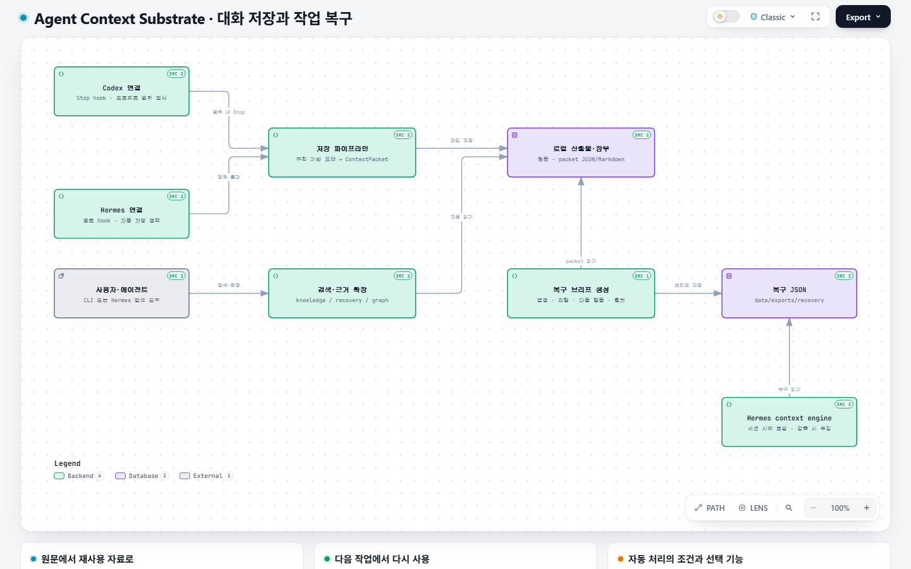

# Agent Context Substrate

**Hermes와 Codex 대화의 결정·진행·원문 근거를 남겨, 다음 작업에서 필요한 맥락을 다시 꺼내 쓰는 도구입니다.**

  [](LICENSE)

[English](README.md) · [빠른 시작](#빠른-시작) · [사용자 가이드](docs/USER_GUIDE.md) · [인터랙티브 구조 보기](https://jjuck.github.io/agent-context-substrate/site/)

ACS는 로컬 Python 패키지와 CLI입니다. Hermes의 `state.db` 또는 Codex thread 메타데이터와 rollout JSONL을 읽어 context packet과 복구 브리프를 만듭니다. Codex 원본은 읽기 전용으로 사용하며, 생성 자료는 설정한 프로젝트의 `data/` 아래에 저장합니다.

## 구조 보기

[](https://jjuck.github.io/agent-context-substrate/site/)

**이미지를 클릭하면 다이어그램을 탐색할 수 있습니다.** 노드별 소스 근거, 확대, 테마 전환과 내보내기를 제공합니다. 그림의 기준 소스는 [`ea83152`](https://github.com/jjuck/agent-context-substrate/commit/ea83152d01dccecf359164971de8e592cad577f3)이며, 실시간 실행 상태를 보여주는 화면은 아닙니다.

## 하는 일

- 원문 출처를 보존하며 세션을 export하고, 규칙 기반 요약과 `ContextPacket` JSON/Markdown, 복구 브리프를 만듭니다.
- 위키·packet·복구 자료·topic map을 로컬에서 읽기 전용으로 검색합니다. 원문 메시지 검색은 선택 사항입니다.
- Codex에서는 비-MCP 플러그인과 프로젝트 범위를 확인하는 Stop hook을 사용하며, watcher를 별도로 실행할 수도 있습니다.
- Hermes에서는 세션 종료 hook과 복구 로딩·작업 중 검색 도구를 제공하는 context engine을 사용합니다.
- 선택 기능으로 V2 요약, 구조화된 atom, 승격 후보 검토와 위키 패치 제안을 제공합니다.

기본값은 **`packet-only`**입니다. 생성 자료는 사람이 읽는 Obsidian 위키 밖에 두며, 위키 쓰기는 명시적인 승격이나 패치 적용으로 수행합니다. V2/LLM 요약은 선택 기능이고, standalone CLI는 `agent-llm`·`hybrid`를 거절합니다. 이 모드는 host 통합 또는 core API를 통해 router를 주입해야 사용할 수 있습니다.

## 빠른 시작

**Python 3.11 이상**과 Git이 필요합니다. 현재 alpha 단계이므로 실제 세션 저장소나 위키를 사용할 때는 가이드를 먼저 확인하세요.

### Windows + Codex

```powershell
git clone https://github.com/jjuck/agent-context-substrate.git
cd agent-context-substrate
powershell -ExecutionPolicy Bypass -File .\scripts\setup-codex-windows.ps1
.\.venv\Scripts\agent-context-substrate.exe doctor-codex --fail-on-issues
.\.venv\Scripts\agent-context-substrate.exe config-codex paths
```

스크립트는 설치 전에 경로를 출력합니다. 기본 `project_root`는 checkout이며, Stop hook은 그 밖의 작업 디렉터리를 건너뜁니다. bootstrap은 `-ProjectRoot`에서 ACS를 설치하므로 이 경로는 ACS checkout이어야 합니다. 다른 저장소의 특정 thread는 수동 finalize로 수집하세요. watcher는 더 넓은 범위를 검색하므로 가이드에서 범위를 확인하세요.

설치한 hook은 Codex에서 검토하고 신뢰해야 실행됩니다. `doctor-codex`는 파일과 설정을 확인하며 hook의 실행 신뢰 상태를 증명하지 않습니다. 경로 선택·hook 검토·도구 설치·watcher 대체 경로는 [Windows 설치 가이드](docs/WINDOWS_CODEX_APP_SETUP.ko.md)에 있습니다.

### 일반 패키지 설치

```bash
git clone https://github.com/jjuck/agent-context-substrate.git
cd agent-context-substrate
python3 -m venv .venv
. .venv/bin/activate
python -m pip install -e .
agent-context-substrate --help
```

Windows에서는 venv를 만든 뒤 `.venv\Scripts\python.exe -m pip install -e .`와 `.venv\Scripts\agent-context-substrate.exe --help`를 사용합니다.

이후 [사용자 가이드](docs/USER_GUIDE.md)에서 Hermes 설치·활성화, 일반 Codex 설치 또는 수동 수집을 진행하세요. 패키지 설치만으로 에이전트 연동이 활성화되지는 않습니다.

## 자주 쓰는 명령

경로와 ID 자리표시자를 실제 값으로 바꾸세요. `project_root`는 생성 자료를 저장하는 위치이자 Codex hook의 작업 디렉터리 범위입니다.

```bash
# Codex 원본과 설치 상태 확인
agent-context-substrate codex-status --codex-home '<CODEX_HOME>'

# MCP 없이 Codex thread 하나 저장
agent-context-substrate codex-finalize \
  --thread-id '<THREAD_ID>' --codex-home '<CODEX_HOME>' \
  --project-root '<PROJECT_ROOT>' --wiki-root '<WIKI_ROOT>'

# 이전 작업의 중단 지점 검색: hit ID는 expand-hit에 사용
agent-context-substrate search-knowledge \
  --query '다음 작업' --mode recovery \
  --project-root '<PROJECT_ROOT>' --wiki-root '<WIKI_ROOT>'
```

각 명령의 현재 옵션은 `<command> --help`로 확인합니다. Hermes 수집, 검색 결과 확장, V2 요약과 위키 검토는 [사용자 가이드](docs/USER_GUIDE.md)에 있습니다.

## 문서 안내

| 목적 | 문서 |
| --- | --- |
| 설치·수집·검색·위키 검토 | [한국어 사용자 가이드](docs/USER_GUIDE.md) / [English](docs/USER_GUIDE.en.md) |
| Windows Codex 설치와 hook 신뢰 | [한국어 설치 가이드](docs/WINDOWS_CODEX_APP_SETUP.ko.md) / [English](docs/WINDOWS_CODEX_APP_SETUP.md) |
| 실행 흐름·생성 자료·어댑터 한계 | [파이프라인](docs/PIPELINE.md) |
| 진단·백업·장애 복구 | [운영](docs/OPERATIONS.md) |
| 재현 가능한 배포 점검 | [릴리스 체크리스트](docs/RELEASE_CHECKLIST.md) |
| 버전별 변경 기록 | [Changelog](CHANGELOG.md) |

## 개발

활성화한 환경에서 실행합니다.

```bash
python -m pip install -e '.[dev]'
python -m pytest -q
python -m ruff check .
git diff --check
```

결과에는 검증한 revision과 플랫폼을 함께 기록하세요. 예전 테스트 수나 특정 사용자의 설치 성공이 새 checkout의 검증 결과는 아닙니다. 실제 연동 smoke에는 명시적인 세션과 설치 경로가 필요합니다. 릴리스 체크리스트를 참고하세요.

## 개인정보와 한계

- 세션 DB·rollout·export·요약에는 비공개 대화, 도구 출력, 인증 정보와 로컬 경로가 들어갈 수 있습니다. 공개 저장소에 commit하지 마세요.
- `.gitignore`는 표준 생성 경로를 제외하지만 모든 보고서 이름과 사용자 지정 출력 경로를 막지는 않습니다. 게시 전에 staged 파일을 확인하세요.
- 검색은 로컬 어휘 기반입니다. LLM 입력 안전 옵션도 모든 비밀 값의 제거를 보장하지는 않습니다.
- 현재 packaged integration은 Hermes와 로컬 Codex입니다. 다른 에이전트에는 어댑터가 필요하며, Hermes 연동 파일을 바꾸면 모듈을 다시 로딩해야 합니다.
- hook 설치·신뢰·실행 성공·산출물 품질은 각각 확인해야 합니다. 위키 제안은 적용 전에 검토하세요.

[MIT 라이선스](LICENSE)를 사용합니다.
